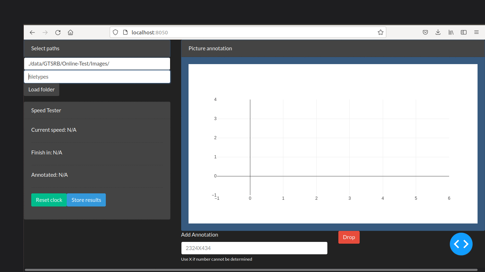
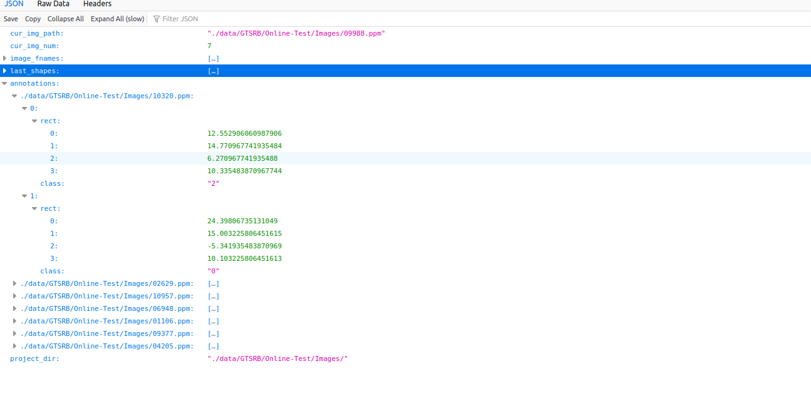

# simple_annotator
Simple prototype for annotating images using Plotly/Dash

# Install packages
```
conda create -f environment.yml
conda activate simple_annotator
```

# Download image data

For example Traffic sign data https://sid.erda.dk/public/archives/daaeac0d7ce1152aea9b61d9f1e19370/published-archive.html via

```
wget https://sid.erda.dk/public/archives/daaeac0d7ce1152aea9b61d9f1e19370/GTSRB_Online-Test-Images.zip
unzip GTSRB_Online-Test-Images.zip
```

# Start app

```
python server.py
```

# Start annotating

* Open the browser localhost:8050
* Enter folder to search for data,  e.g., GTSRB/Online-Test/Images/
* Enter the search pattern, e.g., *.ppm
* Push Load Folder - the first picture should become visible
* Select Draw Rectangle from the Plotly Toolbox
* For each Rectangle put down the respective number (e.g., 0-9) and press ENTER -> the next picture will appear
* SPEED UP :)!!!
* The clock on the left hand side shows you how fast you are annotating and how much longer you need to keep annotating at that speed
* Use annotator_conf.json to train on your annotated data

# See the app in action



# Exemplary results of the annotator_conf.json


